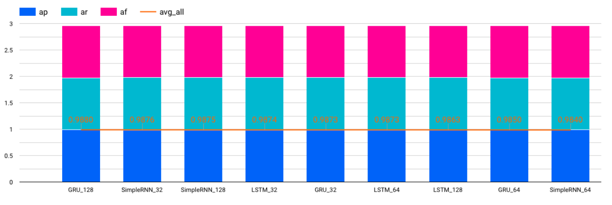

# chatbot-uii-2
chatbot uii in development




## up n running

- setup .env for model that will be used

- up n running with docker
```bash
docker-compose -f docker-compose-build.yml up -d --force-recreate --build
```

## front-end web chatbot mi-botway

- https://github.com/Yuriowindiatmoko2401/mi-botway
